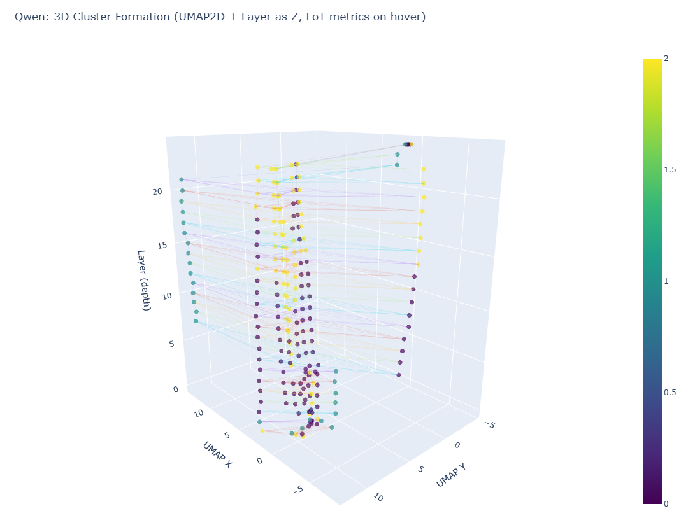

# 🧠 QWEN-MRI: 3D MRI-Style Visualization of Cluster Formation in Qwen Layers

[](LICENSE)
[]()

## Overview

This project extends percolation and cluster-formation analysis of token representations through transformer layers into an interactive 3D visualization. It combines concepts from network science, dimensionality reduction, and the Landscape of Thoughts (LoT) framework to provide insights into how language models process and organize information across their layers.

### Key Features

- **Multi-layer Graph Analysis**: Build kNN or threshold-based graphs at each layer to study connectivity
- **Community Detection**: Automatic cluster detection using Leiden, HDBSCAN, DBSCAN, or KMeans
- **LoT-inspired Metrics**: 
  - Anchor-based features using distances to global centroids
  - Uncertainty quantification via entropy of soft cluster assignments
  - Consistency tracking across layers
- **Unified Manifold Projection**: Common 2D UMAP embedding across all layers for comparable visualization
- **Interactive 3D Visualization**: Plotly-based exploration with nodes, edges, and token trajectories
- **Volumetric Rendering**: Optional PyVista/VTK-based "MRI stack" density visualization
- **Percolation Statistics**: Track giant component formation (φ), cluster counts, and susceptibility (χ)

  
## Installation

### Basic Requirements

```bash
pip install torch transformers pandas numpy scikit-learn networkx plotly umap-learn
```

### Optional Dependencies (Recommended)

For enhanced clustering and visualization:

```bash
# Better clustering algorithms
pip install hdbscan python-igraph leidenalg

# Volumetric rendering
pip install pyvista

# If PyVista complains about display backend:
pip install pyvistaqt
```

### Quick Install

```bash
git clone https://github.com/ugantulga/qwen-mri-3d.git
cd qwen-layer-visualization
pip install -r requirements.txt
```

## Usage

### Basic Example

```python
from qwen_mri_visualization import Config, run_pipeline

# Create configuration
cfg = Config()
cfg.model_name = "Qwen/Qwen1.5-1.8B"
cfg.graph_mode = "knn"  # or "threshold"
cfg.knn_k = 8
cfg.cluster_method = "auto"  # tries Leiden → HDBSCAN → KMeans

# Run the pipeline
run_pipeline(cfg)
```

### Custom Corpus

```python
cfg = Config()
cfg.corpus = [
    "Mongolia has the coldest capital city in the world.",
    ""Machine learning models process data using neural networks.",
    "Climate change affects ecosystems around the world.",
]
run_pipeline(cfg)
```

### Advanced Configuration

```python
cfg = Config()

# Model settings
cfg.model_name = "Qwen/Qwen1.5-1.8B"
cfg.max_length = 64

# Graph construction
cfg.graph_mode = "knn"          # "knn" or "threshold"
cfg.knn_k = 8                   # neighbors per token
cfg.sim_threshold = 0.70        # for threshold mode

# Anchors (LoT-style features)
cfg.anchor_k = 16               # number of global centroids
cfg.anchor_temp = 0.7           # softmax temperature

# Clustering
cfg.cluster_method = "leiden"   # "auto", "leiden", "hdbscan", "dbscan", "kmeans"
cfg.n_clusters_kmeans = 6       # fallback for kmeans

# UMAP embedding
cfg.umap_n_neighbors = 30
cfg.umap_min_dist = 0.05
cfg.umap_metric = "cosine"

# Volume rendering
cfg.grid_res = 128              # voxel resolution
cfg.use_hist2d = True           # fast histogram vs. KDE

# Output
cfg.out_dir = "outputs"

run_pipeline(cfg)
```

## Output Files

After running the pipeline, you'll find the following in the output directory:

- **`qwen_layers_3d.html`**: Interactive 3D Plotly visualization (open in browser)
- **`percolation_stats.json`**: Per-layer percolation observables (φ, #clusters, χ)
- **`lot_metrics_per_token.csv`**: Uncertainty and consistency metrics for each token
- **`anchors.npy`**: Global anchor centroids for reproducibility
- **`qwen_density_volume.npz`**: 3D density volume for offline rendering
- **`qwen_volume.png`**: Volume screenshot (if PyVista is available)

## Visualization Guide

### Interactive 3D Plot

The main visualization shows:
- **Points**: Token representations colored by cluster assignment
- **Lines within layers**: kNN or threshold graph edges
- **Trajectories**: Faint lines connecting the same token across layers
- **Z-axis**: Layer depth (0 = embedding, higher = deeper layers)

**Interaction**:
- Rotate: Click and drag
- Zoom: Scroll or pinch
- Hover: See token, layer, cluster, and uncertainty information

### Interpreting Results

**Percolation Metrics**:
- **φ (phi)**: Fraction of tokens in the giant connected component (0 to 1)
- **#clusters**: Total number of disconnected components
- **χ (chi)**: Average size of non-giant components (susceptibility)

**LoT Metrics**:
- **Uncertainty**: Entropy of soft cluster assignments (higher = more ambiguous)
- **Consistency**: Whether a token's nearest anchor matches the final layer's

## Theoretical Background

This visualization combines several frameworks:

### Percolation Theory in Transformers

Token representations can be viewed as nodes in a similarity graph. As information flows through layers, tokens become more connected based on semantic or syntactic similarity. The emergence of a giant connected component indicates phase transition-like behavior.

### Landscape of Thoughts (LoT)

The LoT framework proposes using:
- **Anchor states**: Representative prototypes in the hidden space
- **Distance-based features**: Low-dimensional features from distances to anchors
- **Uncertainty quantification**: Entropy-based measures of ambiguity
- **Consistency tracking**: Monitoring alignment with final layer representations

### UMAP for Layer Comparison

Using a common 2D UMAP manifold (fit once, transform per layer) allows direct visual comparison of how token distributions evolve, similar to viewing MRI slices through a 3D volume.

## Architecture

```
qwen_mri_visualization.py
├── Configuration (dataclass)
├── Model Loading (QWEN/AutoModel)
├── Hidden State Extraction
├── Graph Construction (kNN/threshold)
├── Anchor Fitting (KMeans on pooled states)
├── Feature Computation (LoT-style distances)
├── Clustering (Leiden/HDBSCAN/KMeans)
├── Percolation Statistics
├── UMAP Embedding (2D common manifold)
├── 3D Plotly Visualization
└── Volume Rendering (PyVista/VTK)
```

## Examples

### Analyzing Semantic Clustering

```python
cfg = Config()
cfg.corpus = [
    "The dog ran through the park.",
    "A cat slept on the couch.",
    "The car drove down the street.",
    "An airplane flew over the city."
]
cfg.cluster_method = "leiden"
run_pipeline(cfg)
```

### Studying Percolation in Longer Sequences

```python
cfg = Config()
cfg.max_length = 128  # Longer sequences
cfg.graph_mode = "threshold"
cfg.sim_threshold = 0.65  # Adjust for more/fewer edges
run_pipeline(cfg)
```

## Citations

If you use this code in your research, please consider citing:

```bibtex
@software{qwen_layer_visualization,
  title={3D Visualization of Cluster Formation in QWEN Transformer Layers},
  author={Uyemaa (Emma) Gantulga },
  year={2025},
  url={https://github.com/ugantulga/qwen-mri-3d}
}
```

**Related Work**:
- QWEN Models: [Qwen Technical Report](https://arxiv.org/abs/2309.16609)
- Landscape of Thoughts: [Zhanke et al., 2025] (https://arxiv.org/abs/2503.22165) 
- UMAP: [McInnes et al., 2018](https://arxiv.org/abs/1802.03426)

## Troubleshooting

### CUDA Out of Memory
- Reduce `max_length`
- Use CPU: `cfg.device = "cpu"`
- Use smaller model: `cfg.model_name = "Qwen/Qwen1.5-0.5B"`

### PyVista Display Issues
- Install Qt backend: `pip install pyvistaqt`
- Or use headless: The .npz volume is always saved for offline rendering

### Leiden Algorithm Not Available
- Install igraph: `pip install python-igraph leidenalg`
- Or use fallback: `cfg.cluster_method = "hdbscan"` or `"kmeans"`

## Contributing

Contributions are welcome! Please feel free to submit a Pull Request. For major changes, please open an issue first to discuss what you would like to change.

## License

MIT License - see [LICENSE](LICENSE) file for details

## Acknowledgments

- QWEN model by Alibaba Cloud
- UMAP implementation by Leland McInnes
- Leiden algorithm by Vincent Traag
- Plotly for interactive visualizations

## Contact

For questions or feedback, please open an issue on GitHub or contact [u.gantulga@gwu.edu]
